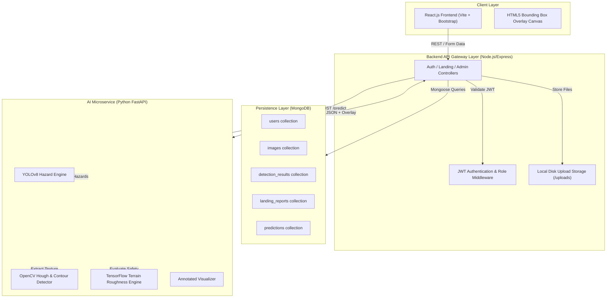
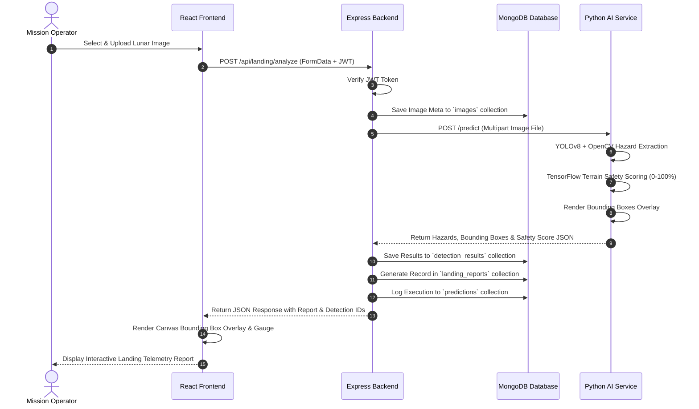

# AI-Based Lunar Landing Assistant

> **Final-Year Engineering Project Submission**  
> An end-to-end, multi-service autonomous lunar surface hazard detection and safe landing zone evaluation platform built with **React**, **Express**, **MongoDB**, **FastAPI**, **YOLOv8**, **OpenCV**, and **TensorFlow**.

---

## 🛰️ Architecture Overview

The system is structured as a monorepo containing three decoupled microservices:

1. **`frontend/`**: React 18 single-page application built with Vite, styled with Bootstrap 5 and custom cosmic dark mode CSS. Features JWT auth session handling, live canvas bounding box drawing, and interactive landing reports.
2. **`backend/`**: Node.js & Express REST API server providing JWT authentication, Multer disk storage for orbital images, proxy forwarding to the AI engine, and persistence across **5 MongoDB collections**.
3. **`ai-service/`**: Python REST API built with FastAPI, OpenCV, PyTorch/YOLOv8, and TensorFlow surface roughness scoring engines.

### System Architecture Diagram



---

## 🔄 End-to-End Data Flow Sequence Diagram



---

## 🗄️ MongoDB Collections & Schemas

The backend uses Mongoose to manage 5 interconnected collections:

1. **`users`**: User account credentials (`name`, `email`, `password` [bcrypt hashed], `role` ['user', 'admin'], `organization`).
2. **`images`**: Metadata for uploaded lunar surface images (`filename`, `originalName`, `path`, `mimetype`, `size`, `uploadedBy`).
3. **`detection_results`**: Bounding boxes and confidence scores (`imageId`, `hazards` [{label, confidence, bbox}], `safeZones`, `overallSafetyScore`, `riskLevel`).
4. **`landing_reports`**: Detailed executive landing assessment (`imageId`, `detectionResultId`, `userId`, `terrainSafetyScore`, `hazardCount`, `recommendedLandingCoordinates`, `environmentalAssessment`, `recommendationStatus`).
5. **`predictions`**: AI execution performance and audit logs (`imageId`, `userId`, `modelVersion`, `executionTimeMs`, `timestamp`).

---

## 🚀 Installation & Quick Start Guide

### Prerequisites
- **Node.js**: v18.0.0 or higher
- **Python**: v3.9+ with `pip`
- **MongoDB**: Local MongoDB instance running on `mongodb://localhost:27017` (or MongoDB Atlas connection string)

---

### Step 1: Clone Monorepo & Setup Environment Files

```bash
# Clone repository
git clone https://github.com/your-username/lunar-landing-assistant.git
cd mini-project2

# Copy environment template files
cp backend/.env.example backend/.env
cp ai-service/.env.example ai-service/.env
cp frontend/.env.example frontend/.env
```

---

### Step 2: Start Backend Service (`backend/`)

```bash
cd backend
npm install
npm run dev
# Express Backend API will start on http://localhost:5000
```

---

### Step 3: Start Python AI Microservice (`ai-service/`)

```bash
cd ai-service

# Create and activate Python virtual environment
python -m venv venv

# On Windows:
venv\Scripts\activate
# On Linux/macOS:
# source venv/bin/activate

# Install dependencies
pip install -r requirements.txt

# Start FastAPI Uvicorn server
uvicorn app.main:app --host 0.0.0.0 --port 8000 --reload
# AI Service API will start on http://localhost:8000
```

*Optional*: Generate sample synthetic lunar surface images for immediate testing:
```bash
python sample_images/create_sample_lunar_image.py
```

---

### Step 4: Start Frontend Application (`frontend/`)

```bash
cd frontend
npm install
npm run dev
# React App will launch on http://localhost:5173
```

---

## 🧪 Automated Testing

### Backend Tests (Jest & Supertest)
```bash
cd backend
npm test
```

### AI Service Tests (Pytest)
```bash
cd ai-service
pytest
```

---

## 📡 REST API Reference

### Authentication Routes (`/api/auth`)
- `POST /api/auth/register` — Register new user credentials
- `POST /api/auth/login` — Authenticate user and receive JWT bearer token
- `GET /api/auth/me` — Fetch current user profile (Protected)

### Landing & AI Analysis Routes (`/api/landing`)
- `POST /api/landing/analyze` — Upload image & run AI hazard evaluation (Protected)
- `GET /api/landing/history` — Retrieve user's scan history (Protected)
- `GET /api/landing/stats` — Fetch dashboard metrics & statistics (Protected)
- `GET /api/landing/report/:id` — Retrieve single landing report details (Protected)

### Admin Routes (`/api/admin`)
- `GET /api/admin/users` — List all registered users (Admin only)
- `GET /api/admin/reports` — Audit all system landing reports (Admin only)
- `GET /api/admin/stats` — System-wide analytics overview (Admin only)
- `DELETE /api/admin/reports/:id` — Delete landing report entry (Admin only)

---

## 🎓 Viva Voce Defense & Project Notes

> [!IMPORTANT]
> **Prototype & Model Notes for Viva Evaluation:**
> - The project combines **YOLOv8** object detection with an **OpenCV computer vision pipeline** (Hough circle transform for craters + Canny contour geometry for boulders) to guarantee fast, offline operation during live project demonstrations.
> - The **Landing Safety Score** (0-100%) is computed dynamically using a Laplacian surface roughness matrix combined with hazard proximity penalties and central region clearance.
> - For a production lunar lander mission (e.g., Artemis / Chandrayaan), the model would be trained on high-resolution NASA LRO (Lunar Reconnaissance Orbiter) NAC/WAC annotated imagery.
